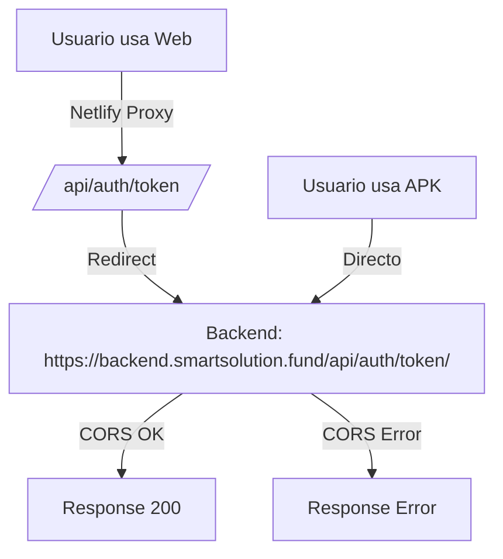

# 🔧 Solución Completa de CORS para APK

## ❌ Problema Identificado

El APK muestra error "An error occurred" al intentar hacer login/registro debido a errores de CORS.

### ¿Por qué ocurre?

1. **En Netlify Web**: El proxy funciona correctamente (`/api/*` → backend)
2. **En APK**: No puede usar el proxy de Netlify, intenta acceder directamente a `/api` que no existe
3. **Resultado**: Error de CORS porque el APK no puede acceder al backend

---

## ✅ Solución Implementada

### 1. Configuración Dual de Variables de Entorno

#### Para Netlify Web (usa proxy):
```env
# .env.netlify o netlify.toml [build.environment]
VITE_API_BASE_URL=/api
VITE_BACKEND_DOMAIN=/api/
```

#### Para APK (acceso directo):
```env
# .env.production
VITE_API_BASE_URL=https://backend.smartsolution.fund/api
VITE_BACKEND_DOMAIN=https://backend.smartsolution.fund/api/
```

### 2. Configuración del Backend (IMPORTANTE)

El backend debe tener CORS configurado para aceptar peticiones desde:
- `https://smartappv5.netlify.app`
- `https://backend.smartsolution.fund`
- El dominio de la app TWA

**Verificar en el backend Django:**

```python
# settings.py
CORS_ALLOWED_ORIGINS = [
    "https://smartappv5.netlify.app",
    "https://backend.smartsolution.fund",
]

CORS_ALLOW_CREDENTIALS = False

CORS_ALLOW_METHODS = [
    'DELETE',
    'GET',
    'OPTIONS',
    'PATCH',
    'POST',
    'PUT',
]

CORS_ALLOW_HEADERS = [
    'accept',
    'accept-encoding',
    'authorization',
    'content-type',
    'dnt',
    'origin',
    'user-agent',
    'x-csrftoken',
    'x-requested-with',
]
```

### 3. Netlify Redirects (para Web)

```toml
# public/netlify.toml
[[redirects]]
  from = "/api/*"
  to = "https://backend.smartsolution.fund/api/:splat"
  status = 200
  force = true
```

---

## 🔍 Verificación

### 1. Verificar Backend CORS

```bash
curl -I -X OPTIONS \
  -H "Origin: https://smartappv5.netlify.app" \
  -H "Access-Control-Request-Method: POST" \
  https://backend.smartsolution.fund/api/auth/token/
```

Debe responder con:
```
Access-Control-Allow-Origin: https://smartappv5.netlify.app
Access-Control-Allow-Methods: POST, OPTIONS
```

### 2. Verificar Variables de Entorno

```bash
# En localhost (desarrollo)
echo $VITE_API_BASE_URL
# Debe ser: /api

# En producción (APK)
# Debe ser: https://backend.smartsolution.fund/api
```

### 3. Probar en Navegador

```javascript
// Abrir consola en https://smartappv5.netlify.app
fetch('https://backend.smartsolution.fund/api/auth/token/', {
  method: 'POST',
  headers: {
    'Content-Type': 'application/json',
  },
  body: JSON.stringify({
    username: 'test',
    password: 'test'
  })
}).then(r => r.json()).then(console.log)
```

No debe haber errores de CORS.

---

## 📱 Rebuilding APK con la Solución

### 1. Reconstruir Frontend

```bash
cd "/Users/nicolas/Documentos locales/smart solution app/frontend"
npm run build
```

### 2. Redesplegar a Netlify

```bash
netlify deploy --prod --dir=dist
```

### 3. Regenerar APK

```bash
cd "/Users/nicolas/Documentos locales/smart solution app/smartapp1/android"
bubblewrap build --skipPwaValidation
```

Responde:
- Apply changes? → `yes`
- versionName → `1.3.0`
- Password → `smartsolution` (ambas)

---

## 🌐 Conectar GitHub con Netlify

### Paso 1: Ir a Netlify

1. Ve a: https://app.netlify.com/
2. Click en "Add new site" → "Import an existing project"
3. Click en "GitHub"

### Paso 2: Seleccionar Repositorio

1. Busca: `Herocku2/appsmartv9`
2. Click en el repositorio

### Paso 3: Configurar Build

```
Branch to deploy: main
Build command: npm run build
Publish directory: dist
```

### Paso 4: Variables de Entorno

Agrega estas variables:

```
VITE_API_BASE_URL=/api
VITE_AUTH_TOKEN_ENDPOINT=/auth/token/
VITE_REGISTER_REF_BASE=/auth/register/
VITE_BACKEND_DOMAIN=/api/
```

### Paso 5: Deploy

Click en "Deploy site"

---

## ⚠️ IMPORTANTE: Configurar el Backend

**El backend DEBE tener CORS habilitado para el dominio de Netlify.**

Si tienes acceso al backend, verifica:

```python
# Django settings.py
CORS_ALLOWED_ORIGINS = [
    "https://smartappv5.netlify.app",
    "https://[nuevo-dominio].netlify.app",  # El nuevo dominio de Netlify
]
```

Si NO tienes acceso al backend, contacta al administrador del backend para que agregue el nuevo dominio de Netlify a la lista de orígenes permitidos.

---

## 🧪 Testing

### Test 1: Web (debe usar proxy)

```bash
# En https://smartappv5.netlify.app
# Abrir DevTools → Network
# Hacer login
# Verificar que las peticiones vayan a: /api/auth/token/
# NO debe haber errores de CORS
```

### Test 2: APK (acceso directo)

```bash
# Instalar APK
# Intentar login
# Debe conectarse a: https://backend.smartsolution.fund/api/auth/token/
# NO debe haber errores
```

---

## 🔄 Flujo Completo



---

## 📞 Contacto Backend

Si los errores persisten después de implementar esta solución:

1. **Verificar que el backend tenga CORS configurado**
2. **Agregar el dominio de Netlify a CORS_ALLOWED_ORIGINS**
3. **Verificar que el backend esté accesible desde el APK**

---

## ✅ Checklist Final

- [ ] Backend tiene CORS configurado
- [ ] Variables de entorno correctas en Netlify
- [ ] `.env.production` usa URL completa del backend
- [ ] `netlify.toml` configurado con redirects
- [ ] Código subido a GitHub
- [ ] Netlify conectado a GitHub
- [ ] APK regenerado con nueva configuración
- [ ] Probado en dispositivo Android
- [ ] Login funciona sin errores

---

**Repositorio GitHub**: https://github.com/Herocku2/appsmartv9
